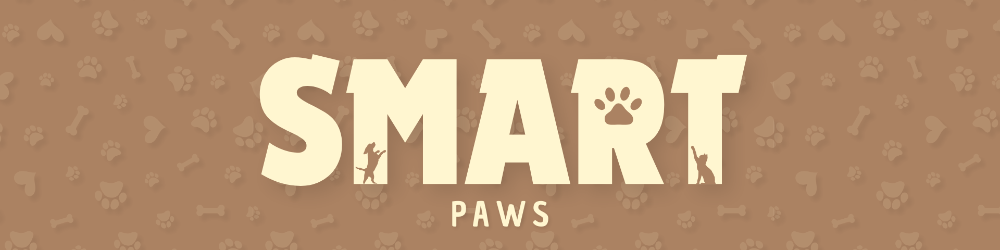
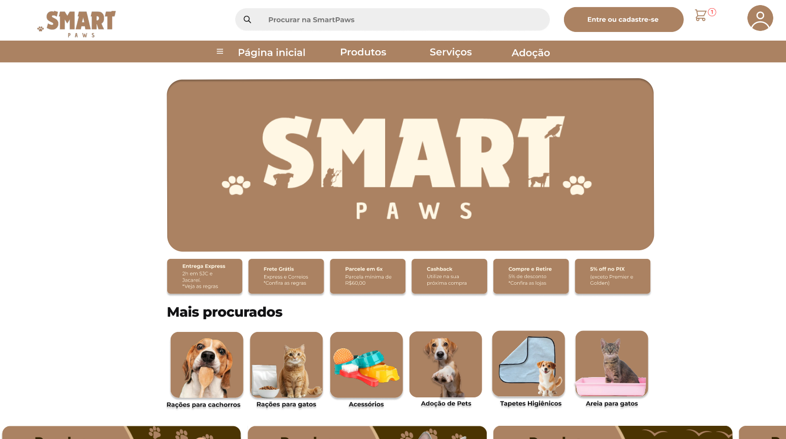

  

---
## Sumário
 - [Sobre o projeto](#smartpaws)
 - [Objetivo do Projeto](#objetivo-do-projeto)
 - [Tecnologias e Programas que serão utilizadas](#tecnologias-e-programas-que-serão-utilizadas)
 - [Layout do Projeto](#layout-do-projeto)

# SmartPaws  

**SmartPaws** é mais que um site: é um espaço dedicado a transformar a vida dos animais de estimação e de quem os ama. Nosso objetivo é promover o bem-estar, a saúde e a felicidade dos pets, oferecendo produtos e serviços de qualidade de forma acessível e prática.
Pensando em todos os apaixonados por animais, a plataforma conecta donos, interessados em adoção e defensores da causa animal. Com uma seção exclusiva de adoção, facilitamos a conexão entre doadores, ONGs e futuros adotantes, garantindo que mais animais encontrem lares cheios de cuidado e carinho.

---

## Objetivo do Projeto

 A **SmartPaws** é muito mais que um site: é um **espaço** feito para **cuidar** e **mimar** os **animais de estimação!** Nosso **objetivo** é promover o **bem-estar**, a **saúde** e a **felicidade dos pets**, oferecendo **produtos** e **serviços** de **qualidade**, de forma acessível e prática. 🐶🐱

Pensando em todos os **apaixonados por animais**, a SmartPaws conecta donos, adotantes e defensores da causa animal, proporcionando uma experiência completa para cuidar de cada pet com **amor e responsabilidade.** ❤️

🛒 **O que oferecemos**

- 🐾 Adoção de pets: seção exclusiva com informações completas sobre cada animal, conectando ONGs, doadores e adotantes, garantindo que mais pets encontrem lares cheios de carinho.

- 🍖 Alimentos e produtos: opções completas para cães, gatos e animais exóticos, garantindo saúde e nutrição para cada pet.

- 🧸 Acessórios e brinquedos: camas, coleiras, roupas, brinquedos e itens de higiene, para proporcionar conforto, diversão e bem-estar.

🌟 **Nossa missão**

Na SmartPaws, acreditamos que cada pet merece amor, cuidado e proteção. Por isso, fortalecemos nossa missão com:

- 🤝 Parcerias com ONGs locais, garantindo um fluxo constante de animais para adoção

- 🏠 Campanhas de proteção e abrigo para animais sem lar

- 💞 Conexão entre a comunidade e o bem-estar animal, tornando mais fácil transformar vidas de pets e humanos

---

## Tecnologias e Programas que serão utilizadas

  
  
  
  
  
  

---
## Layout do Projeto

### Tela Inicial

  

---

  Feito com carinho pela equipe SmartPaws🐾

